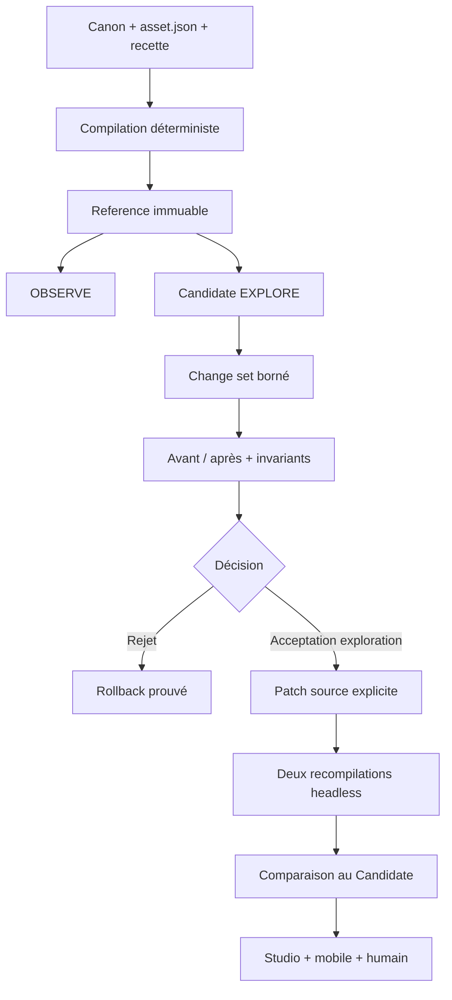

# Blender Visual Workbench MCP

| Champ | Valeur |
| --- | --- |
| ID | `ASSET3D-WORKBENCH-001` |
| Classe | `CONTRACT` |
| Version | `1.0.0` |
| Cycle de vie | `IN_REVIEW` |
| Propriétaire | Founder / Tech Art |
| Statut spécification | `PASS` |
| Statut implémentation | `PASS_LOCAL_VERTICAL_SLICE` |
| Studio / mobile | `UNKNOWN` |
| `productionApproved` | `false` |
| Dernière revue | 2026-07-17 |

## Finalité

Le Workbench ajoute une boucle d'inspection et d'expérimentation visuelle entre
la compilation Blender déterministe et la validation finale. Il permet de
mesurer, isoler, comparer et corriger un build sans transformer une scène
Blender modifiée en source de production implicite.

> MCP pour voir, diagnostiquer et expérimenter. Change set pour expliquer.
> Recette pour conserver. Blender headless pour reconstruire. Scripts pour
> valider. Studio pour prouver. Humain pour approuver.

## Autorité

L'ordre est obligatoire :

1. le canon visuel décide ce qu'est l'objet ;
2. `asset.json` fixe ses dimensions, composants, matériaux, états et budgets ;
3. la recette paramétrique est la source reproductible ;
4. `build/source.blend` est une reconstruction vérifiable ;
5. le Workbench observe et expérimente sur des copies ;
6. seul un changement transcrit dans la source peut être promu ;
7. Studio et le mobile réel fournissent la preuve d'usage ;
8. l'humain conserve l'approbation artistique et de production.

Une amélioration observée dans `Candidate` reste un prototype. Le Workbench ne
modifie jamais silencieusement le canon, le contrat autoritatif, le générateur,
Roblox Studio ou Roblox Cloud.

## Architecture retenue

Le parcours normal n'installe pas le serveur communautaire BlenderMCP. Le
projet expose un serveur MCP local `stdio` et démarre l'exécutable Blender 5.2
exact en mode headless au travers d'un dispatcher fermé. Cette décision évite
un listener TCP, une extension Blender persistante et un outil Python
arbitraire tout en conservant l'inspection, les rendus et les expérimentations
bornées.



## Modes

### `OBSERVE`

- copie de référence en lecture seule ;
- manifeste de scène, hiérarchie, transformations, bounds, pivot, grounding,
  matériaux, modificateurs et statistiques ;
- captures normalisées ;
- aucune copie `Candidate` et aucune opération esthétique.

### `EXPLORE`

- copie `Candidate` isolée ;
- opérations uniquement sur des composants et matériaux déclarés ;
- preview en mémoire sans sauvegarde ;
- sauvegarde seulement sur `Candidate/source.blend` ;
- backup avant mutation et rollback automatique sur violation.

### `PATCH`

`change-set.json` décrit l'observation, la cause probable, l'intention, les
cibles, les valeurs avant/après, les invariants, les vues de revue, le budget
de triangles et la méthode de rollback. `source-patch.json` lie chaque
opération à un JSON Pointer de la recette. Ces fichiers n'accordent aucune
autorité de production.

### `PROMOTE`

Le Workbench peut préparer une source dans `PromotionSandbox/`, puis compiler
deux fois avec `--factory-startup`. Cette sandbox décrit la source attendue,
mais ne peut pas remplacer silencieusement `asset.json`.

Après transcription explicite du changement dans la source autoritative,
`verify_promotion` reçoit obligatoirement le chemin exact du contrat
autoritatif. Il vérifie :

- le chemin attendu ;
- la révision ;
- le binding du canon ;
- l’égalité sémantique exacte avec la source préparée ;
- la reproduction de chaque opération du candidat ;
- deux compilations de la véritable source autoritative ;
- le déterminisme sémantique, GLB et FBX.

Avant transcription, la vérification doit échouer sans compiler une source
substituée. Une sandbox `PASS` prouve le mécanisme ; seul un rapport portant
`authoritativeSourceModified=true` prouve que la recette durable reproduit
effectivement le candidat. Même dans ce cas, `productionApproved` reste faux
jusqu’aux gates Studio, mobile et humains.

## Opérations autorisées

| Opération | Cible | Limite normale |
| --- | --- | --- |
| `SET_COMPONENT_DIMENSION` | composant déclaré | delta ≤ 2 studs et ≤ 50 % |
| `MOVE_COMPONENT` | composant déclaré | delta ≤ 1 stud |
| `ROTATE_COMPONENT` | composant déclaré | delta ≤ 15° |
| `SET_COMPONENT_VISIBILITY` | composant déclaré | booléen, non promotable par défaut |
| `SET_MATERIAL_ROLE` | composant + matériau déclarés | un rôle existant |
| `SET_MATERIAL_VALUE` | matériau déclaré | roughness/metallic, delta ≤ 0,25 |

Toute instruction esthétique vague est d'abord transformée en observation,
hypothèse mesurable, propriété ciblée, valeur actuelle, valeur proposée,
invariants, vues et rollback. Une violation du canon produit
`CANON_CONFLICT`, pas une correction silencieuse.

## Outils MCP

Le serveur expose exactement :

```text
get_blender_environment
begin_workbench_session
get_scene_manifest
create_change_set
preview_change_set
apply_change_set
revert_last_change
reset_candidate
compare_candidate_to_reference
prepare_promotion_sandbox
verify_promotion
close_workbench_session
```

Il n'expose aucun outil d'exécution Python arbitraire, suppression de fichier,
installation d'add-on, téléchargement externe, publication Roblox, réécriture
du contrat ou modification du canon.

## Transaction et preuves

Chaque session est liée aux hashes du contrat, du canon, du compilateur, du
manifest et du `.blend`. Elle produit :

```text
assets-3d/<asset>/workbench/<session>/
├── Reference/source.blend
├── Candidate/source.blend
├── Review/runtime/
├── Evidence/before/renders/
├── Evidence/after-preview/renders/
├── Evidence/after/renders/
├── Evidence/rollback/
├── session.json
├── base-scene-manifest.json
├── diagnosis.json
├── change-set.json
├── source-patch.json
├── geometry-diff.json
├── material-diff.json
├── invariant-report.json
└── promotion-report.json
```

Le dossier est ignoré par Git. Un rapport ou une capture ne devient durable
que par sélection explicite. Le journal `Evidence/operations.jsonl` est
append-only pendant la session.

## Sécurité

- serveur MCP `stdio` projet, sans adresse ni port réseau ;
- Blender 5.2.0 LTS et chemin absolu enregistrés ;
- verrou de dépôt : une opération Blender à la fois ;
- environnement transmis par allow-list ;
- variables `ROBLOX_*` absentes du processus Blender ;
- `DISABLE_TELEMETRY=true` et `PYTHONHASHSEED=0` ;
- références en lecture seule et re-hashées ;
- écritures confinées à la session ;
- aucun fournisseur, téléchargement ou secret externe ;
- erreurs fermées sans traceback dans le protocole MCP ;
- toutes les mutations MCP demandent une approbation Codex avec
  `default_tools_approval_mode = "writes"`.

## Commandes

```powershell
powershell -NoProfile -ExecutionPolicy Bypass -File .\scripts\r3d.ps1 blender-mcp-doctor --repo .
powershell -NoProfile -ExecutionPolicy Bypass -File .\scripts\r3d.ps1 blender-inspect .\assets-3d\<asset>\asset.json
powershell -NoProfile -ExecutionPolicy Bypass -File .\scripts\r3d.ps1 blender-workbench .\assets-3d\<asset>\asset.json --mode explore
powershell -NoProfile -ExecutionPolicy Bypass -File .\scripts\r3d.ps1 blender-create-change <session.json> --input <draft.json>
powershell -NoProfile -ExecutionPolicy Bypass -File .\scripts\r3d.ps1 blender-preview-change <change-set.json>
powershell -NoProfile -ExecutionPolicy Bypass -File .\scripts\r3d.ps1 blender-apply-change <change-set.json>
powershell -NoProfile -ExecutionPolicy Bypass -File .\scripts\r3d.ps1 blender-revert <session.json>
powershell -NoProfile -ExecutionPolicy Bypass -File .\scripts\r3d.ps1 blender-compare <session.json>
powershell -NoProfile -ExecutionPolicy Bypass -File .\scripts\r3d.ps1 blender-prepare-promotion-sandbox <change-set.json>
powershell -NoProfile -ExecutionPolicy Bypass -File .\scripts\r3d.ps1 blender-verify-promotion .\assets-3d\<asset>\asset.json --session <session-id>
```

Le serveur est déclaré dans `.codex/config.toml`. Codex doit être redémarré
après un changement de cette configuration pour que la nouvelle surface soit
exposée dans la tâche.

## Gates

| Gate | Critère | Preuve locale 2026-07-17 |
| --- | --- | --- |
| `CAP-BLENDER-MCP-001` | Blender/process/transport identifiés | `PASS` |
| `CAP-BLENDER-MCP-002` | scène et captures reproductibles | `PASS` |
| `CAP-BLENDER-MCP-003` | `OBSERVE` ne mute pas la référence | `PASS` |
| `CAP-BLENDER-MCP-004` | opération bornée + diff + invariants | `PASS` |
| `CAP-BLENDER-MCP-005` | rollback revient au hash baseline | `PASS` |
| `CAP-BLENDER-MCP-006` | source autoritative transcrite reproduit le candidat | `PASS` |
| `CAP-BLENDER-MCP-007` | deux builds sémantiquement identiques | `PASS` |
| `CAP-BLENDER-MCP-008` | surface fermée, secrets absents, audit | `PASS_LOCAL` |

Ces gates prouvent le Workbench local et la capacité de vérifier une
transcription autoritative explicite. Ils ne prouvent ni l'approbation
artistique, ni l'import Studio, ni le rendu mobile physique, ni la production.

## Vertical slice courante

La preuve initiale `defense_barricade_small` est enregistrée dans
[BLENDER_WORKBENCH_VERTICAL_SLICE_2026-07-17.md](evidence/BLENDER_WORKBENCH_VERTICAL_SLICE_2026-07-17.md).

La boucle `PROMOTE` complète a ensuite été prouvée par la session
`defense-barricade-small-52ad124a9c26` :

- la vérification avant transcription a échoué ;
- le changement `barricade-v9-service-cue-001` a été transcrit dans
  `asset.json` révision 9 ;
- l’égalité sémantique avec la sandbox a passé ;
- quatre opérations ont été reproduites ;
- deux builds de la source autoritative ont produit des GLB et FBX identiques ;
- la session a été fermée avec sa preuve de promotion intacte.

La révision 15 a ensuite été réinspectée en lecture seule dans la session
`defense-barricade-small-012c50f1fcc4` : 42 composants, 1 496 triangles,
bounds 8 × 4 × 2, pivot et grounding conformes, référence immuable.
